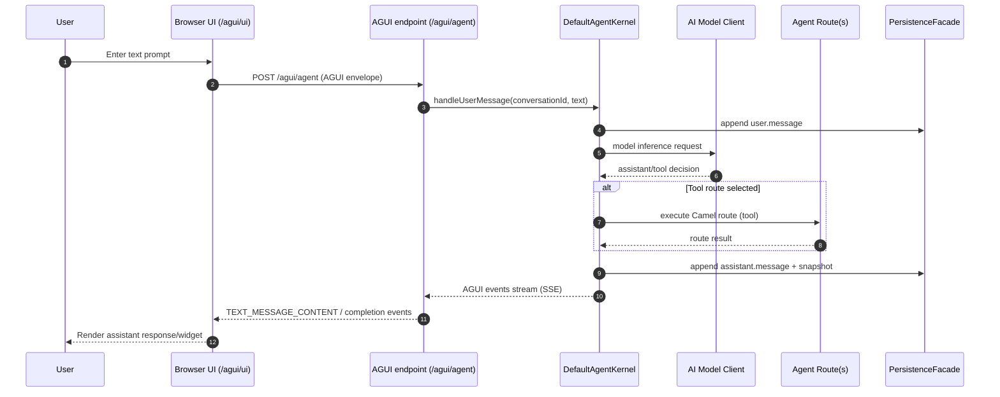
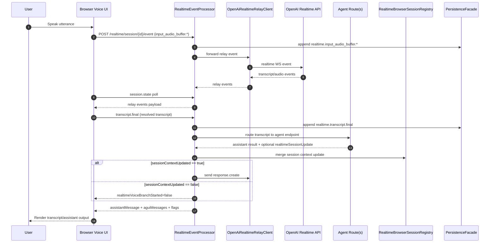

# Architecture

## Runtime

1. `agent.md` is loaded by `MarkdownBlueprintLoader`.
2. Tool declarations are converted to `ToolSpec` and registered in `DefaultToolRegistry`.
3. `DefaultAgentKernel` handles message loop:
   - append `user.message`
   - invoke model client
   - enforce tool allow-list
   - validate input/output schema
   - execute tool route through Camel
   - append `assistant.message` and `snapshot.written`
4. Events are persisted via `PersistenceFacade` implementation.

## Persistence Mapping

- `agent.conversation` => conversation event stream
- `agent.task` => task snapshots
- `agent.dynamicRoute` => dynamic route metadata snapshots

`camel-agent-persistence-dscope` maps these flows to `FlowStateStore` operations.

## Phase-2 Orchestration Behavior

- Async waiting path:
  - `handleUserMessage(..., "task.async <checkpoint>")` creates persisted `TaskState` with `WAITING`.
  - emits `task.waiting`.
- Resume path:
  - `resumeTask(taskId)` transitions task `RESUMED -> FINISHED`.
  - emits `task.resumed` and final `assistant.message`.
- Dynamic route lifecycle:
  - `handleUserMessage(..., "route.instantiate <templateId>")` persists `DynamicRouteState` transitions `CREATED -> STARTED`.

## Distributed Claim/Lock Strategy

For load-balanced resume safety, task ownership is persisted as lease locks:

- Lock flow type: `agent.task.lock`
- Claim event: `task.lock.claim` (`ownerId`, `leaseUntil`)
- Release event: `task.lock.release`

Algorithm:

1. Read current lock state.
2. If active lease exists for another owner, deny claim.
3. Append claim event with optimistic expected version.
4. On optimistic conflict, claim fails (another node won).

## AGUI Integration

Sample AGUI integration uses `camel-ag-ui-component` runtime routes/processors directly.

Frontend transport in `samples/agent-support-service`:

- browser UI is served from `GET /agui/ui`
- frontend sends AGUI envelope via either:
  - `POST /agui/agent` (POST+SSE bridge)
  - `WS /agui/rpc` (AGUI over WebSocket)
- backend returns AGUI events for the selected transport
- frontend renders assistant text from AGUI message content events

Correlation between agent conversations and transport identifiers is handled in core via `CorrelationRegistry`:

- source key: `agent.conversationId`
- correlation keys: `agui.sessionId`, `agui.runId`, `agui.threadId`

Debug audit trail includes available correlation metadata in payload (`payload._correlation`).

### Realtime Voice Frontend Behavior (Sample)

`samples/agent-support-service` `/agui/ui` voice behavior:

- single toggle control manages start/stop state (`idle`, `live`, `busy`)
- pause profile drives VAD silence timeout for both relay and WebRTC session setup:
  - `fast` -> `800ms`
  - `normal` -> `1200ms`
  - `patient` -> `1800ms`
- UI displays current pause timeout in label and listening status text
- WebRTC transcript log captures input/output transcript events for diagnostics
- output transcript processing is de-duplicated at `response.output_audio_transcript.done` handling to prevent duplicate assistant transcript display
- collapsible `Instruction seed (debug)` panel shows the currently seeded WebRTC instruction context
- instruction debug panel auto-opens when transport switches to WebRTC and on initial load when transport is already WebRTC

### Pre-Conversation Realtime Context Seed

Before first user transcript turn, `POST /realtime/session/{conversationId}/init` seeds profile context from blueprint metadata/system text into session state:

- `metadata.camelAgent.agentProfile.name`
- `metadata.camelAgent.agentProfile.version`
- `metadata.camelAgent.agentProfile.purpose`
- `metadata.camelAgent.agentProfile.tools[]`
- `metadata.camelAgent.context.agentPurpose`
- `metadata.camelAgent.context.agentFocusHint`

This seed is consumed by WebRTC instruction construction so first-turn responses are aligned with agent purpose/tool scope before transcript history exists.

### Event Flow Scenarios

#### 1) No Voice Agent (Text-only AGUI)



#### 2) Voice Agent via Camel Relay



#### 3) Voice Agent via Browser WebRTC (Direct)

```mermaid
sequenceDiagram
  autonumber
  participant U as User
  participant FE as Browser UI (WebRTC mode)
  participant OAI as OpenAI Realtime API
  participant REP as RealtimeEventProcessor
  participant AR as Agent Route(s)
  participant REG as RealtimeBrowserSessionRegistry
  participant PF as PersistenceFacade

  U->>FE: Speak utterance
  FE->>OAI: Send audio over WebRTC data/media channels
  OAI-->>FE: input transcript events
  FE->>REP: POST transcript.final
  REP->>PF: append realtime.transcript.final
  REP->>AR: route transcript (Camel agent route)
  AR-->>REP: assistant result + optional session patch
  REP->>REG: merge route + transcript + assistant context
  alt session context updated
    REP-->>FE: realtimeVoiceBranchStarted=true
  else session context not updated
    REP-->>FE: realtimeVoiceBranchStarted=false
  end

  alt realtimeVoiceBranchStarted == true
    FE->>OAI: response.create (or backend may trigger via relay path)
    OAI-->>FE: audio + output transcript
    FE-->>U: Play voice response + render text
  else realtimeVoiceBranchStarted == false
    FE-->>U: No response.create; waits/retries by policy
  end
```

Operational guarantee for voice transcript routing:

1. Realtime event ingress is persisted (`realtime.<eventType>`) for audit trail visibility.
2. Transcript is routed through agent/Camel routes first.
3. Realtime session context is merged with route result + transcript/assistant metadata.
4. `response.create` is allowed only after step 3 succeeds.

#### Scenario Comparison Matrix

| Scenario | Primary input trigger | Agent route execution point | Realtime session context update point | `response.create` initiator | Audit event type coverage |
| --- | --- | --- | --- | --- | --- |
| No voice agent (text-only AGUI) | `POST /agui/agent` with user text | `DefaultAgentKernel` routes tool calls after model decision | Not applicable (no realtime voice session) | Not applicable | `user.message`, tool/assistant/snapshot events via `PersistenceFacade` |
| Voice via Camel Relay | `POST /realtime/session/{id}/event` (`input_audio_buffer.*`, `transcript.final`) | `RealtimeEventProcessor` routes transcript to agent endpoint | `RealtimeEventProcessor` merges route/session patch into `RealtimeBrowserSessionRegistry` before voice branch | Backend relay path (`RealtimeEventProcessor -> OpenAiRealtimeRelayClient`) when `sessionContextUpdated=true` | Ingress `realtime.<eventType>` persisted for all received realtime events + route/assistant events |
| Voice via Browser WebRTC (direct) | Browser sends audio directly to OpenAI; frontend posts `transcript.final` to Camel | `RealtimeEventProcessor` routes transcript to agent endpoint | `RealtimeEventProcessor` merges route + transcript/assistant metadata before branch flag | Frontend WebRTC data channel when backend returns `realtimeVoiceBranchStarted=true` (backend remains gatekeeper) | Ingress `realtime.<eventType>` persisted for all events received by Camel realtime endpoint |

Legend:

- **Initiator**: component that sends the actual `response.create` event.
- **Backend gatekeeper**: Camel backend condition (`sessionContextUpdated` / `realtimeVoiceBranchStarted`) that must succeed before response generation is allowed.

## Spring AI ChatMemory Integration

- `DscopeChatMemoryRepository` (`camel-agent-spring-ai`) implements Spring AI `ChatMemoryRepository`.
- Memory is stored in DScope persistence as snapshots:
  - `flowType=agent.chat.memory`, `flowId=<conversationId>`
  - conversation index: `flowType=agent.chat.memory.index`, `flowId=all`
- `SpringAiMessageSerde` performs message serialization/deserialization for:
  - `UserMessage`
  - `SystemMessage`
  - `AssistantMessage` (with tool calls)
  - `ToolResponseMessage`

## Spring AI Provider Gateway

`MultiProviderSpringAiChatGateway` (`camel-agent-spring-ai`) is the default runtime gateway when:

- `agent.runtime.ai.mode=spring-ai`
- no explicit gateway override is configured

Provider mapping:

- `openai` -> Spring AI `OpenAiChatModel` (Chat Completions)
- `claude`/`anthropic` -> Spring AI `AnthropicChatModel`
- `gemini` -> Spring AI `VertexAiGeminiChatModel`

Tool calls are exposed to the kernel through Spring AI `AssistantMessage.ToolCall` mapping into internal `AiToolCall`.

## Audit Trail Granularity

Persistence adapter supports `agent.audit.granularity`:

- `none`: no audit event persistence
- `info`: process step persistence
- `error`: process step persistence + error data payload for error events
- `debug`: process step persistence + full payloads and metadata
