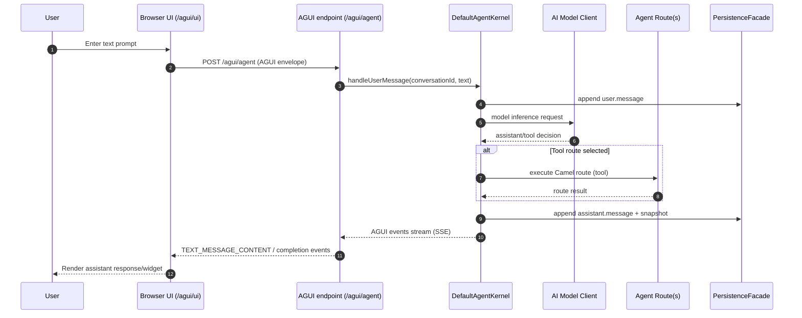
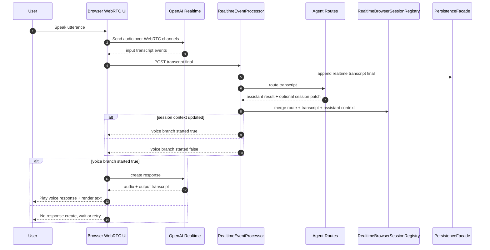

# Architecture

## Runtime

The core runtime model remains plan-driven and conversation-centric:

- a request resolves to one concrete blueprint version
- blueprint metadata becomes tools, realtime defaults, AGUI behavior, and now optional resource context
- `DefaultAgentKernel` owns the message loop, tool execution, and persisted turn state
- AGUI, browser realtime, A2A, admin refresh, and newer SIP/session facades all converge on the same conversation and plan-selection model

1. Runtime resolves a concrete plan selection for the exchange:
   - explicit request `planName` / `planVersion`
   - else sticky `conversation.plan.selected`
   - else catalog defaults from `agent.agents-config`
   - legacy fallback: `agent.blueprint`
2. The resolved plan version blueprint (`agent.md`) is loaded by `MarkdownBlueprintLoader`.
  - standard blueprint metadata still defines the system prompt, tool declarations, AGUI pre-run behavior, and realtime defaults
  - blueprint `resources` are resolved at load time through `BlueprintResourceResolver`
  - chat instruction rendering can append resource text under configured budgets
  - realtime session init can seed resource-backed context for browser or SIP voice sessions
3. Tool declarations are converted to `ToolSpec` and registered in `DefaultToolRegistry`.
4. `DefaultAgentKernel` handles message loop:
   - append `user.message`
   - invoke model client
   - enforce tool allow-list
   - validate input/output schema
   - execute tool route through Camel
   - append `assistant.message` and `snapshot.written`
5. Events are persisted via `PersistenceFacade` implementation.

Plan-aware runtime behavior:

- kernels are cached by resolved `{planName, planVersion, blueprintUri}`
- first successful resolution appends `conversation.plan.selected`
- later explicit overrides append a new `conversation.plan.selected`
- audit and runtime refresh derive active blueprint from persisted plan-selection events instead of assuming one global blueprint
- A2A-exposed public agents are mapped separately from the internal plan catalog

Runtime bootstrap also binds mutable operational controls and optional archive services:

- `RuntimeControlState` for live audit granularity updates
- `ConversationArchiveService` for optional transcript-focused persistence (`conversation.*`)
- optional `AsyncEventPersistenceFacade` wrapper when `agent.audit.async.enabled=true`

## Plan Catalog

Catalog source:

- `agent.agents-config`

Catalog model:

- multiple named plans
- multiple versions per plan
- exactly one default plan
- exactly one default version per plan
- optional plan-level and version-level `ai` overrides

Each version points to a concrete markdown blueprint location. The blueprint remains the unit that defines:

- system prompt
- tools
- AGUI pre-run behavior
- realtime defaults

Plan-level AI behavior:

- plan-level `ai` provides defaults shared by all versions in a plan
- version-level `ai` overrides provider, model, token, temperature, and provider-specific property keys for the selected version
- the resolved AI block is persisted in `conversation.plan.selected` and passed into model execution through `ModelOptions`

Internal request headers:

- `agent.planName`
- `agent.planVersion`
- `agent.resolvedPlanName`
- `agent.resolvedPlanVersion`
- `agent.resolvedBlueprint`

## Route-Driven Agent Sessions

This is an additional invocation façade over the existing `agent:` runtime, not a separate execution engine.

Two invocation layers exist for ordinary Camel routes:

1. Raw `agent:` endpoint invocation
   - `agent.conversationId` is the durable session key
   - missing `agent.conversationId` means create a new session
   - reusing `agent.conversationId` means continue an existing session
2. Structured session invocation
   - `AgentSessionService` normalizes `conversationId`, `sessionId`, and `threadId`
   - `AgentSessionInvokeProcessor` accepts map or JSON request bodies and returns a structured JSON response
   - request `params` are preserved in exchange properties as `agent.session.params`

Structured session request shape:

- `prompt`
- `conversationId`
- `sessionId`
- `threadId`
- `planName`
- `planVersion`
- `params`

Structured session response shape:

- `conversationId`
- `sessionId`
- `created`
- `message`
- `events[]`
- `taskState`
- `resolvedPlanName`
- `resolvedPlanVersion`
- `resolvedBlueprint`
- `params`

This keeps route-to-agent integration explicit and avoids losing `AgentResponse` metadata when a route needs more than just assistant text, while still resolving plans, tools, persistence, and correlations through the same core runtime.

## Blueprint Resource Context

Blueprint static resources are part of the existing blueprint/runtime model, not a separate MCP or attachment subsystem.

Resource lifecycle:

1. blueprint declares `resources[]`
2. `MarkdownBlueprintLoader` parses them into `BlueprintResourceSpec`
3. `BlueprintResourceResolver` loads content from `classpath:`, `file:`, plain paths, or `http(s)`
4. Camel PDF extraction is used for PDF resources
5. `BlueprintInstructionRenderer` injects bounded text into chat instructions
6. `RealtimeBrowserSessionInitProcessor` injects bounded text into realtime session seed context
7. `RuntimeResourceRefreshProcessor` can re-resolve resources and append refresh events to active conversations

Budget controls:

- chat: `agent.runtime.chat.resource-context-max-chars`
- realtime: `agent.runtime.realtime.resource-context-max-chars`

This design keeps blueprint resources plan-aware and conversation-aware without inventing a second resource persistence model or changing the underlying kernel/tool execution flow.

## Persistence Mapping

- `agent.conversation` => conversation event stream
- `agent.task` => task snapshots
- `agent.dynamicRoute` => dynamic route metadata snapshots

`camel-agent-persistence-dscope` maps these flows to `FlowStateStore` operations.

## A2A Integration

Camel Agent uses `camel-a2a-component` as the protocol/runtime layer and keeps agent-specific behavior on top.

Agent-side responsibilities:

- exposed-agent mapping (`agent.runtime.a2a.exposed-agents-config`)
- mapping public A2A agent ids to local `{planName, planVersion}`
- parent/root/linked conversation correlation
- agent audit events and routed-back parent notifications
- AGUI/A2A correlation metadata

Generic A2A responsibilities delegated to `camel-a2a-component`:

- task lifecycle
- idempotency
- task event streaming
- push notification config handling
- optional persistence-backed A2A task/event stores
- JSON-RPC envelope, dispatch, SSE, and agent-card plumbing

Inbound A2A request flow:

1. `POST /a2a/rpc` receives a core A2A method.
2. `SendMessage` / `SendStreamingMessage` resolve a public A2A agent id from exposed-agent config.
3. The public agent maps to a local `planName` / `planVersion`.
4. Runtime creates or reuses a linked local conversation for the A2A task.
5. The selected local plan is invoked through `agent:`.
6. Result is written back into the shared A2A task service and audit trail.

Outbound A2A tool flow:

1. A local agent selects a tool with `endpointUri: a2a:...`.
2. `A2AToolClient` sends an A2A JSON-RPC request to the remote agent.
3. Remote task id / remote conversation id / linked local conversation id are persisted as correlation.
4. Audit records outbound start/completion and linked conversation metadata.

### Shared Task/Session Model

Camel Agent does not require a private A2A task store.

Startup behavior:

- if `a2aTaskService`, `a2aTaskEventService`, and `a2aPushConfigService` already exist in the Camel registry, runtime reuses them
- otherwise runtime creates shared defaults using the same persistence configuration rules as `camel-a2a-component`

This design keeps one A2A task/session space available to:

- agent-backed A2A handlers
- outbound `a2a:` tools
- non-agent Camel routes that also use the same bound A2A services

Implementation note:

- `AgentA2ATaskAdapter` is the thin agent-side layer that adds agent metadata and audit behavior on top of the shared `A2ATaskService`
- the older duplicate agent-owned A2A task repository model is no longer the active design

## Non-Blocking Audit Path

Runtime can move audit writes off the request thread:

- config flag: `agent.audit.async.enabled=true`
- wrapper: `AsyncEventPersistenceFacade`
- applied to:
  - primary audit/event persistence facade
  - optional conversation archive persistence facade

Async facade behavior:

- `appendEvent(...)` enqueues events into a bounded in-memory queue
- a dedicated background worker flushes events to the delegate persistence facade
- retries use fixed backoff (`agent.audit.async.retry-delay-ms`)
- shutdown waits up to `agent.audit.async.shutdown-timeout-ms`
- periodic metrics logs report enqueue/persist/drop/retry counters

Read-path behavior:

- `loadConversation(...)` merges queued-but-not-yet-flushed events with persisted history
- `listConversationIds(...)` merges pending conversation ids with persisted ids

This keeps audit projections and conversation views coherent while making audit/archive persistence non-blocking for normal request flows.

## Phase-2 Orchestration Behavior

- Async waiting path:
  - `handleUserMessage(..., "task.async <checkpoint>")` creates persisted `TaskState` with `WAITING`.
  - emits `task.waiting`.
- Resume path:
  - `resumeTask(taskId)` transitions task `RESUMED -> FINISHED`.
  - emits `task.resumed` and final `assistant.message`.
- Dynamic route lifecycle:
  - `handleUserMessage(..., "route.instantiate <templateId>")` persists `DynamicRouteState` transitions `CREATED -> STARTED`.

## Distributed Claim/Lock Strategy

For load-balanced resume safety, task ownership is persisted as lease locks:

- Lock flow type: `agent.task.lock`
- Claim event: `task.lock.claim` (`ownerId`, `leaseUntil`)
- Release event: `task.lock.release`

Algorithm:

1. Read current lock state.
2. If active lease exists for another owner, deny claim.
3. Append claim event with optimistic expected version.
4. On optimistic conflict, claim fails (another node won).

## AGUI Integration

Sample AGUI integration uses `camel-ag-ui-component` runtime routes/processors directly.

Frontend transport in `samples/agent-support-service`:

- browser UI is served from `GET /agui/ui`
- frontend sends AGUI envelope via either:
  - `POST /agui/agent` (POST+SSE bridge)
  - `WS /agui/rpc` (AGUI over WebSocket)
- backend returns AGUI events for the selected transport
- backend preserves assistant text but may also attach `widget`, `a2ui`, and `locale` metadata when the assistant returns structured ticket JSON
- frontend renders assistant text from AGUI message content events and prefers `a2ui` or `widget` data when available

Structured UI behavior:

- `AgentAgUiPreRunTextProcessor` can enrich non-realtime AGUI params with `widget` and `a2ui`
- `RealtimeEventProcessor` attaches the same shape to routed transcript responses under both `aguiMessages[*].a2ui` and top-level `a2ui`
- `AgentBlueprint.a2ui.surfaces[]` declares app-owned catalog, surface, and locale JSON resources per agent/version
- the sample frontend advertises `a2uiSupportedCatalogIds` from its local registry and maps accepted `catalogId` values back into existing widget renderers
- this keeps per-agent and per-version UI variants inside the same plan-selection model while leaving concrete UI assets in the app rather than core

Correlation between agent conversations and transport identifiers is handled in core via `CorrelationRegistry`:

- source key: `agent.conversationId`
- correlation keys: `agui.sessionId`, `agui.runId`, `agui.threadId`

Debug audit trail includes available correlation metadata in payload (`payload._correlation`).

A2A correlation keys now also include:

- `a2a.agentId`
- `a2a.remoteConversationId`
- `a2a.remoteTaskId`
- `a2a.linkedConversationId`
- `a2a.parentConversationId`
- `a2a.rootConversationId`

Plan-aware request behavior:

- `POST /agui/agent` accepts top-level `planName` / `planVersion`
- `POST /realtime/session/{conversationId}/init` accepts top-level `planName` / `planVersion`
- `POST /realtime/session/{conversationId}/event` accepts top-level `planName` / `planVersion`
- AGUI and realtime processors forward these as Camel headers to `agent:`
- AGUI and realtime paths also accept top-level `locale` and resolve `Accept-Language`; core forwards the resolved value as `agent.locale`

## SIP, Realtime, and Outbound Call Flow

These voice and telephony paths extend the existing realtime and route-driven architecture. They do not introduce a second conversation model.

Voice-oriented runtime behavior is split into inbound session ingress, route-driven agent turns, and outbound provider integration.

Inbound SIP-style flow:

1. SIP or telephony adapter maps provider call identity to stable `conversationId`
2. `/sip/adapter/v1/session/{conversationId}/start` normalizes call-start metadata into realtime `/init`
3. `/sip/adapter/v1/session/{conversationId}/turn` normalizes final transcript payload into realtime `transcript.final`
4. `RealtimeEventProcessor` routes transcript turns into the same `agent:` plan/tool flow as web chat
5. route output may emit realtime session patches for future turns

Outbound support-call flow:

1. support blueprint tool `support.call.outbound` targets a local Camel route
2. `SupportOutboundCallProcessor` builds `OutboundSipCallRequest`
3. provider-neutral `SipProviderClient` places the call and returns `OutboundSipCallResult`
4. provider-specific adapter, currently Twilio in `camel-agent-twilio`, handles transport integration
5. runtime stores call correlation and later webhook/relay processing reuses the same conversation id

Design intent:

- core owns conversation correlation, call contracts, and OpenAI realtime call-state integration
- adapters own provider-specific call placement and ingress mapping
- agent flows remain conversation-centric across chat, browser voice, SIP ingress, and outbound follow-up calls

## Conversation Archive Persistence (Separate from Audit Trail)

Conversation archive persistence is an optional, transcript-focused stream designed for replay/UX use cases.

- default flag: `agent.conversation.persistence.enabled=false`
- optional dedicated store mapping prefix: `agent.conversation.persistence.*`
- event family:
  - `conversation.user.message`
  - `conversation.assistant.message`
  - `conversation.realtime.observed`

Write paths:

- AGUI pre-run turns (`AgentAgUiPreRunTextProcessor`) append user/assistant archive events
- realtime transcript flows (`RealtimeEventProcessor`) append observed and final turn archive events

Read path:

- MCP tool `audit.conversation.sessionData` returns filtered archive events for a conversation (and optional `sessionId`)

Design intent:

- use audit trail (`user.message`, `tool.*`, `realtime.*`) for diagnostics/operations
- use archive trail (`conversation.*`) for transcript playback and conversation-centric UX

### Realtime Voice Frontend Behavior (Sample)

`samples/agent-support-service` `/agui/ui` voice behavior:

- single toggle control manages start/stop state (`idle`, `live`, `busy`)
- locale selector persists to URL/local storage and updates `document.documentElement.lang`
- pause profile drives VAD silence timeout for both relay and WebRTC session setup:
  - `fast` -> `800ms`
  - `normal` -> `1200ms`
  - `patient` -> `1800ms`
- UI displays current pause timeout in label and listening status text
- WebRTC transcript log captures input/output transcript events for diagnostics
- AGUI and realtime requests include both `locale` and `Accept-Language`
- transcription language is derived from the selected locale language tag instead of being hard-coded to English
- A2UI envelopes are normalized back into the existing `ticket-card` sample renderer so the frontend remains compatible with existing widget artifacts
- output transcript processing is de-duplicated at `response.output_audio_transcript.done` handling to prevent duplicate assistant transcript display
- collapsible `Instruction seed (debug)` panel shows the currently seeded WebRTC instruction context
- instruction debug panel auto-opens when transport switches to WebRTC and on initial load when transport is already WebRTC

### Canonical WebRTC Flow (Source of Truth)

- Define WebRTC flow from `samples/agent-support-service/src/main/resources/frontend/webrtc-test.html`.
- Do not use `index.html` to define WebRTC flow defaults.
- Default control contract from `webrtc-test.html`:
  - `#transport-mode` is disabled and fixed to `webrtc` (`Browser WebRTC (direct)`)
  - `#agui-transport-mode=post` (`POST + SSE`)
  - `#duplex-mode=half`
  - `#vad-pause=normal` (1200ms)
  - `#voice-setting=alloy`
  - `Instruction seed (debug)` panel remains available and auto-opens in WebRTC mode
  - `WebRTC transcript log` panel + clear action remains available for diagnostics

WebRTC flow contract:

1. Browser requests ephemeral token via `/realtime/session/{conversationId}/token`.
2. Browser starts direct WebRTC session with OpenAI Realtime.
3. Browser posts transcript events to Camel realtime endpoint for routing and context merge.
4. Backend (`RealtimeEventProcessor`) routes transcript to agent tools/routes and returns branch flags, assistant text, locale, and optional A2UI/widget payloads.
5. Browser renders transcript + assistant output in the WebRTC UI path.

Separation rule:

- Relay-specific finalize/commit orchestration must not be used as the WebRTC baseline flow definition.

### Pre-Conversation Realtime Context Seed

Before first user transcript turn, `POST /realtime/session/{conversationId}/init` seeds profile context from blueprint metadata/system text into session state:

- `metadata.camelAgent.agentProfile.name`
- `metadata.camelAgent.agentProfile.version`
- `metadata.camelAgent.agentProfile.purpose`
- `metadata.camelAgent.agentProfile.tools[]`
- `metadata.camelAgent.plan.name`
- `metadata.camelAgent.plan.version`
- `metadata.camelAgent.plan.blueprint`
- `metadata.camelAgent.context.agentPurpose`
- `metadata.camelAgent.context.agentFocusHint`

This seed is consumed by WebRTC instruction construction so first-turn responses are aligned with agent purpose/tool scope before transcript history exists.

## Audit Projection

Audit stores raw events (`user.message`, `tool.*`, `realtime.*`, `conversation.plan.selected`, `agent.definition.refreshed`) and projects conversation state on read.

Conversation-level audit metadata now includes:

- `agentName`
- `agentVersion`
- `planName`
- `planVersion`
- `blueprintUri`
- `ai`

Per-step audit projections also include the same resolved agent block so operators can see which plan/version produced each message or tool step.

Audit list and search responses also expose a top-level `ai` block so dashboards do not need to unwrap nested metadata to identify the provider/model actually used for a conversation.

When async audit is enabled, these projections include both persisted and still-queued events because the read path merges pending async entries before rendering audit responses.

A2A audit additions:

- `conversation.a2a.request.accepted`
- `conversation.a2a.response.completed`
- `conversation.a2a.outbound.started`
- `conversation.a2a.outbound.completed`
- conversation metadata projection for linked A2A conversations and remote task ids

### Event Flow Scenarios

#### 1) No Voice Agent (Text-only AGUI)

#### 2) Voice Agent via Camel Relay

#### 3) Voice Agent via Browser WebRTC (Direct)

Operational guarantee for voice transcript routing:

1. Realtime ingress persistence (`realtime.<eventType>`) is governed by current audit granularity (`none|error|info|debug`) and can be changed live.
2. Transcript is routed through agent/Camel routes first.
3. Realtime session context is merged with route result + transcript/assistant metadata.
4. `response.create` is allowed only after step 3 succeeds.

#### Scenario Comparison Matrix

| Scenario | Primary input trigger | Agent route execution point | Realtime session context update point | `response.create` initiator | Audit event type coverage |
| --- | --- | --- | --- | --- | --- |
| No voice agent (text-only AGUI) | `POST /agui/agent` with user text | `DefaultAgentKernel` routes tool calls after model decision | Not applicable (no realtime voice session) | Not applicable | `user.message`, tool/assistant/snapshot events via `PersistenceFacade` |
| Voice via Camel Relay | `POST /realtime/session/{id}/event` (`input_audio_buffer.*`, `transcript.final`) | `RealtimeEventProcessor` routes transcript to agent endpoint | `RealtimeEventProcessor` merges route/session patch into `RealtimeBrowserSessionRegistry` before voice branch | Backend relay path (`RealtimeEventProcessor -> OpenAiRealtimeRelayClient`) when `sessionContextUpdated=true` | Ingress `realtime.<eventType>` persisted according to active audit granularity; route/assistant events persisted; optional `conversation.*` archive events when enabled |
| Voice via Browser WebRTC (direct) | Browser sends audio directly to OpenAI; frontend posts `transcript.final` to Camel | `RealtimeEventProcessor` routes transcript to agent endpoint | `RealtimeEventProcessor` merges route + transcript/assistant metadata before branch flag | Frontend WebRTC data channel when backend returns `realtimeVoiceBranchStarted=true` (backend remains gatekeeper) | Events received by Camel realtime endpoint persisted according to active audit granularity; optional `conversation.*` archive events when enabled |

Legend:

- **Initiator**: component that sends the actual `response.create` event.
- **Backend gatekeeper**: Camel backend condition (`sessionContextUpdated` / `realtimeVoiceBranchStarted`) that must succeed before response generation is allowed.

## Spring AI ChatMemory Integration

- `DscopeChatMemoryRepository` (`camel-agent-spring-ai`) implements Spring AI `ChatMemoryRepository`.
- Memory is stored in DScope persistence as snapshots:
  - `flowType=agent.chat.memory`, `flowId=<conversationId>`
  - conversation index: `flowType=agent.chat.memory.index`, `flowId=all`
- `SpringAiMessageSerde` performs message serialization/deserialization for:
  - `UserMessage`
  - `SystemMessage`
  - `AssistantMessage` (with tool calls)
  - `ToolResponseMessage`

## Spring AI Provider Gateway

`MultiProviderSpringAiChatGateway` (`camel-agent-spring-ai`) is the default runtime gateway when:

- `agent.runtime.ai.mode=spring-ai`
- no explicit gateway override is configured

Provider mapping:

- `openai` -> Spring AI `OpenAiChatModel` (Chat Completions)
- `claude`/`anthropic` -> Spring AI `AnthropicChatModel`
- `gemini` -> Spring AI `VertexAiGeminiChatModel`

Per-conversation provider behavior:

- runtime starts from the globally configured Spring AI properties
- resolved plan/version `ai` overrides are merged per conversation
- `provider`, `model`, `temperature`, `maxTokens`, and flattened provider-specific `properties` are applied at call time without mutating the global application configuration

Tool calls are exposed to the kernel through Spring AI `AssistantMessage.ToolCall` mapping into internal `AiToolCall`.

## Audit Trail Granularity

Persistence adapter supports `agent.audit.granularity`:

- `none`: no audit event persistence
- `info`: process step persistence
- `error`: process step persistence + error data payload for error events
- `debug`: process step persistence + full payloads and metadata

Granularity can be changed at runtime through MCP admin tools:

- `runtime.audit.granularity.get`
- `runtime.audit.granularity.set`

## MCP Admin Runtime Controls

Sample admin MCP endpoint supports Streamable HTTP and runtime operations.

Transport requirement:

- `Accept: application/json, text/event-stream`

Runtime control methods:

- `runtime.audit.granularity.get`
- `runtime.audit.granularity.set`
- `runtime.conversation.persistence.get`
- `runtime.conversation.persistence.set`

Archive read method:

- `audit.conversation.sessionData`

These methods are listed via `tools/list` and executed via `tools/call`.
